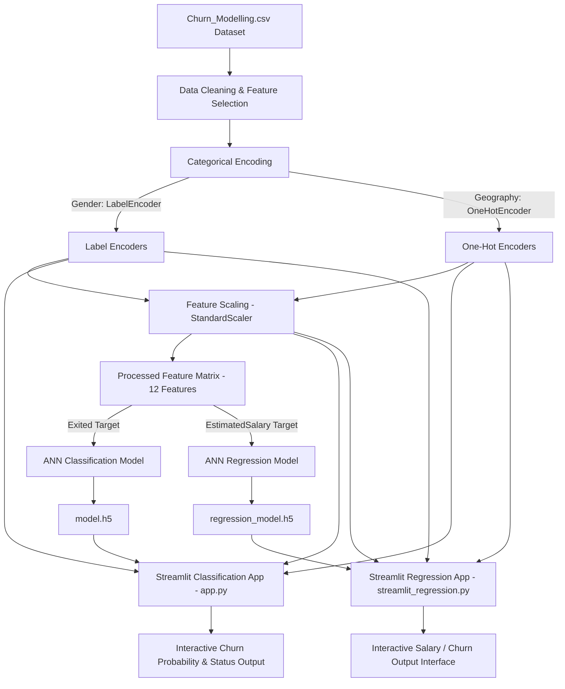

# Customer Churn & Salary Prediction using Artificial Neural Networks (ANN)

[](https://www.python.org/)
[](https://www.tensorflow.org/)
[](https://streamlit.io/)
[](https://scikit-learn.org/)
[](LICENSE)
[](https://github.com/Shashwatfr/ann-classification)

---

## 📌 Project Overview

Customer retention is a critical metric for financial institutions and subscription-based service providers. Acquiring a new customer often costs five to seven times more than retaining an existing one. This repository delivers an end-to-end Machine Learning ecosystem centered on **Customer Churn Prediction** and **Estimated Salary Regression** using Deep Learning (**Artificial Neural Networks**).

### Key Highlights
- **Business Problem**: Identify bank customers who are at high risk of closing their accounts (churning), enabling customer success teams to initiate proactive retention strategies. Additionally, model continuous customer economic indicators like estimated annual salary.
- **Why Customer Churn Prediction Matters**: Early identification of churn risk directly correlates with reduced revenue loss, higher lifetime customer value (CLV), and actionable insights into customer dissatisfaction metrics (e.g., balance, product usage, activity level).
- **Why Artificial Neural Networks (ANN)**: Non-linear customer behavior patterns and complex feature interactions (combining demographics, geography, financial metrics, and activity indices) benefit significantly from multi-layer feedforward neural networks over linear baselines.
- **Regression Module Overview**: Beyond binary classification, a dedicated ANN regression model estimates customer financial profiles (`EstimatedSalary`), demonstrating multi-task Deep Learning applicability on tabular banking data.
- **Why Streamlit**: Delivers lightweight, dynamic, interactive web interfaces allowing non-technical business stakeholders and analysts to run real-time inference by adjusting customer attributes via sliders and forms.
- **Project Objective**: Provide a production-grade codebase with modular pipelines for data preprocessing, hyperparameter optimization, model persistence, and dual interactive UI deployments.

---

## 📑 Table of Contents

- [📌 Project Overview](#project-overview)
- [✨ Features](#features)
- [🏗️ Project Architecture](#project-architecture)
- [📁 Repository Structure](#repository-structure)
- [💻 Tech Stack](#tech-stack)
- [📊 Dataset Analysis](#dataset-analysis)
- [⚙️ Data Preprocessing Pipeline](#data-preprocessing-pipeline)
- [🧠 Artificial Neural Network (Classification)](#artificial-neural-network-classification)
- [🔍 Hyperparameter Tuning](#hyperparameter-tuning)
- [📈 Regression Module](#regression-module)
- [🖥️ Streamlit Applications](#streamlit-applications)
  - [Customer Churn Prediction App](#customer-churn-prediction-app-apppy)
  - [Salary Prediction App](#salary-prediction-app-streamlit_regressionpy)
- [🛠️ Installation Guide](#installation-guide)
- [🚀 Usage Guide](#usage-guide)
- [💾 Model & Artifact Persistence](#model-artifact-persistence)
- [📊 Results & Evaluation](#results-evaluation)
- [🔮 Future Improvements](#future-improvements)
- [🤝 Contributing](#contributing)
- [📜 License](#license)
- [📬 Contact](#contact)
- [🙏 Acknowledgements](#acknowledgements)

---

## ✨ Features

- ✅ **Customer Churn Prediction**: High-precision binary classification model built with Keras/TensorFlow.
- ✅ **Artificial Neural Network Architecture**: Multi-layer perceptron with ReLU hidden activations and Sigmoid output.
- ✅ **Salary Prediction via Regression**: Continuous variable ANN regressor using Mean Absolute Error (MAE) loss.
- ✅ **Interactive Streamlit Web Apps**: Dual web interfaces (`app.py` & `streamlit_regression.py`) for real-time predictions.
- ✅ **Categorical Encoding**: Robust `LabelEncoder` for binary attributes (`Gender`) and `OneHotEncoder` for multi-class geographic data (`Geography`).
- ✅ **Feature Scaling**: `StandardScaler` transformations fitted on 12 features to normalize numerical dynamic ranges.
- ✅ **Hyperparameter Optimization**: Systematic Grid Search using `SciKeras` (`KerasClassifier`) across neurons, hidden layers, and training epochs.
- ✅ **Training Callbacks**: Integrated `TensorBoard` logging for epoch-by-epoch metric tracking and `EarlyStopping` to eliminate overfitting.
- ✅ **Probability Output**: Direct probability score inference with user-configurable classification thresholds.
- ✅ **Model Persistence**: Serialized `.h5` Keras neural networks and `.pkl` scikit-learn transformers.
- ✅ **Clean Project Structure**: Explicit separation of training notebooks, inference scripts, logs, and deployment apps.

---

## 🏗️ Project Architecture



---

## 📁 Repository Structure

```
ann-classification/
│
├── .devcontainer/               # Container configuration for VS Code Remote Development
├── .git/                        # Git version control metadata
├── .gitignore                   # Ignored files (virtualenvs, checkpoints, cache)
├── .python-version              # Python version lock (3.11)
├── LICENSE                      # GNU General Public License v3.0
├── README.md                    # Project documentation
├── requirements.txt             # Python dependencies manifest
│
├── Churn_Modelling.csv          # Primary banking dataset (10,000 records)
│
├── app.py                       # Main Streamlit web app for Churn Classification
├── streamlit_regression.py      # Streamlit web app for Salary Regression / Model Inference
│
├── experiments.ipynb            # Notebook: Data EDA, preprocessing & ANN Classification training
├── hyperparametertuningann.ipynb # Notebook: GridSearchCV hyperparameter optimization using SciKeras
├── prediction.ipynb             # Notebook: Single-sample end-to-end inference verification
├── salaryregression.ipynb       # Notebook: Data prep & ANN Regression training for EstimatedSalary
│
├── model.h5                     # Pre-trained Keras ANN Classification Model artifact
├── regression_model.h5          # Pre-trained Keras ANN Regression Model artifact
│
├── label_encoder_gender.pkl     # Serialized LabelEncoder for 'Gender'
├── onehot_encoder_geo.pkl       # Serialized OneHotEncoder for 'Geography'
├── scaler.pkl                   # Serialized StandardScaler for input feature normalization
│
├── logs/                        # TensorBoard log directory for Classification model runs
│   └── fit/                     # Event logs containing training loss/accuracy metrics
└── regressionlogs/              # TensorBoard log directory for Regression model runs
    └── fit/                     # Event logs containing training loss/MAE metrics
```

### Key File Descriptions

- **`app.py`**: Web interface built with Streamlit. Accepts user inputs via sliders and dropdowns, loads `model.h5` and pickles, and predicts customer churn probability.
- **`streamlit_regression.py`**: Streamlit interface configured for regression model exploration and prediction.
- **`experiments.ipynb`**: Primary research notebook containing dataset analysis, feature transformations, baseline ANN architecture construction, training, and early stopping execution.
- **`hyperparametertuningann.ipynb`**: Performs systematic cross-validated grid search over layer counts, neuron counts, and epoch lengths using `SciKeras`.
- **`prediction.ipynb`**: Demonstrates manual feature preprocessing and inference execution on a single synthetic record.
- **`salaryregression.ipynb`**: Dedicated regression notebook training an ANN to predict `EstimatedSalary` using `mean_absolute_error` loss.
- **`Churn_Modelling.csv`**: Banking benchmark dataset containing demographic and account information for 10,000 customers.
- **`requirements.txt`**: Complete list of Python package dependencies required to run training and inference scripts.

---

## 💻 Tech Stack

| Technology | Category | Purpose & Usage in Repository |
| :--- | :--- | :--- |
| **Python 3.11** | Language | Core programming language locked via `.python-version`. |
| **TensorFlow 2.19.0** | Deep Learning | Framework used to build, train, evaluate, and serialize Keras ANN models (`model.h5`, `regression_model.h5`). |
| **Keras** | High-Level API | Sequential neural network architecture building blocks (`Dense`, `Sequential`). |
| **Scikit-Learn** | Machine Learning | Data preprocessing (`StandardScaler`, `LabelEncoder`, `OneHotEncoder`), model evaluation, and `GridSearchCV` hyperparameter tuning via `SciKeras`. |
| **Pandas** | Data Wrangling | DataFrame loading, column dropping, categorical joining, and feature manipulation. |
| **NumPy** | Numerical Computing | Array structure transformations, float management, and matrix operations. |
| **Matplotlib** | Visualization | Plotting dataset distributions and training curves. |
| **Streamlit** | Web Deployment | Interactive front-end application creation (`app.py`, `streamlit_regression.py`). |
| **SciKeras** | Integration | Scikit-learn wrapper for Keras models used in `hyperparametertuningann.ipynb`. |
| **TensorBoard** | Monitoring | Real-time experiment tracking and loss history logging (`logs/`, `regressionlogs/`). |
| **Jupyter Notebook** | Environment | Interactive research, prototyping, and experimentation environment. |

---

## 📊 Dataset Analysis

The model is trained on the **Churn_Modelling.csv** dataset, containing records for **10,000 bank customers**.

### Dataset Specifications

- **Total Rows**: 10,000
- **Total Columns**: 14 (raw) -> 12 (processed features)
- **Primary Classification Target**: `Exited` (`0` = Customer Retained, `1` = Customer Churned)
- **Primary Regression Target**: `EstimatedSalary` (Continuous USD / currency amount)

### Feature Breakdown

| Feature Name | Data Type | Feature Type | Description / Range |
| :--- | :--- | :--- | :--- |
| `RowNumber` | Integer | Metadata | Dropped during preprocessing (row index) |
| `CustomerId` | Integer | Metadata | Dropped during preprocessing (unique ID) |
| `Surname` | String | Metadata | Dropped during preprocessing (customer last name) |
| `CreditScore` | Integer | Numerical Feature | Credit rating score (350 - 850) |
| `Geography` | Categorical | Categorical Feature | France, Spain, Germany (One-Hot Encoded to 3 binary columns) |
| `Gender` | Categorical | Categorical Feature | Female, Male (Label Encoded: Female=0, Male=1) |
| `Age` | Integer | Numerical Feature | Customer age in years (18 - 92) |
| `Tenure` | Integer | Numerical Feature | Number of years as a bank customer (0 - 10) |
| `Balance` | Float | Numerical Feature | Current account balance |
| `NumOfProducts` | Integer | Numerical Feature | Number of bank products utilized (1 - 4) |
| `HasCrCard` | Binary | Numerical Feature | Credit card ownership flag (0 = No, 1 = Yes) |
| `IsActiveMember` | Binary | Numerical Feature | Member activity status flag (0 = Inactive, 1 = Active) |
| `EstimatedSalary` | Float | Numerical / Target | Estimated annual salary |
| `Exited` | Binary | Target / Feature | Churn status flag (0 = Stayed, 1 = Left) |

---

## ⚙️ Data Preprocessing Pipeline

Inferred directly from `experiments.ipynb` and `salaryregression.ipynb`:

```
Raw CSV → Drop Identifiers → Label Encoding → One-Hot Encoding → Train/Test Split → Standard Scaling → Input Tensor
```

1. **Identifier Removal**:
   - Dropped non-predictive metadata columns: `RowNumber`, `CustomerId`, `Surname`.
2. **Label Encoding (`Gender`)**:
   - `LabelEncoder()` converts `Female` → `0` and `Male` → `1`.
   - Encoder state persisted to `label_encoder_gender.pkl`.
3. **One-Hot Encoding (`Geography`)**:
   - `OneHotEncoder()` transforms `Geography` into three sparse columns: `Geography_France`, `Geography_Germany`, `Geography_Spain`.
   - Encoder state persisted to `onehot_encoder_geo.pkl`.
4. **Dataset Division**:
   - Independent features (`X`) vs Target variable (`y`).
   - Split using `train_test_split(X, y, test_size=0.2, random_state=42)`.
   - **Train Set**: 8,000 samples | **Test Set**: 2,000 samples.
5. **Feature Normalization**:
   - `StandardScaler()` fits on `X_train` and transforms both `X_train` and `X_test`.
   - Scaler state persisted to `scaler.pkl`.

---

## 🧠 Artificial Neural Network (Classification)

The primary churn prediction network is defined and trained in `experiments.ipynb`.

### Model Topology

```
Input Layer (12 Features) 
   │
   ▼
Dense Layer 1 (64 Neurons, ReLU Activation)
   │
   ▼
Dense Layer 2 (32 Neurons, ReLU Activation)
   │
   ▼
Output Layer (1 Neuron, Sigmoid Activation)
```

### Hyperparameters & Configuration

- **Input Dimension**: `12` (features post one-hot encoding and scaling)
- **Hidden Layer 1**: `64` units, `ReLU` activation
- **Hidden Layer 2**: `32` units, `ReLU` activation
- **Output Layer**: `1` unit, `Sigmoid` activation (yields probability score $P(\text{Churn}) \in [0, 1]$)
- **Optimizer**: `Adam(learning_rate=0.01)`
- **Loss Function**: `binary_crossentropy`
- **Evaluation Metric**: `accuracy`
- **Epochs**: `100` (controlled by early stopping)
- **Batch Size**: `32` (default, resulting in 250 batches/epoch for 8,000 samples)
- **Callbacks**:
  - `TensorBoard`: Logs training metrics to `logs/fit/`
  - `EarlyStopping`: `monitor='val_loss'`, `patience=10`, `restore_best_weights=True`
- **Model Saving**: Saved as `model.h5`

---

## 🔍 Hyperparameter Tuning

Optimized in `hyperparametertuningann.ipynb` using `GridSearchCV` paired with `SciKeras.wrappers.KerasClassifier`.

### Search Configuration

- **Cross-Validation Strategy**: 3-Fold Stratified Cross-Validation (`cv=3`)
- **Total Configurations Tested**: 16 combinations (48 individual fold fits)
- **Parameter Grid**:
  ```python
  param_grid = {
      'neurons': [16, 32, 64, 128],
      'layers': [1, 2],
      'epochs': [50, 100]
  }
  ```

### Grid Search Results

| Parameter | Tested Values | Optimal Selection |
| :--- | :--- | :--- |
| **Neurons per Layer** | `16`, `32`, `64`, `128` | **`16`** |
| **Hidden Layers** | `1`, `2` | **`1`** |
| **Epochs** | `50`, `100` | **`100`** |
| **Best CV Accuracy Score** | — | **`85.76%` (0.857624)** |

*Key Insight*: A streamlined 1-hidden-layer network with 16 neurons achieved superior cross-validation accuracy, preventing over-parameterization on tabular inputs.

---

## 📈 Regression Module

The regression pipeline trained in `salaryregression.ipynb` demonstrates continuous feature estimation.

### Regression Overview

- **Objective**: Predict `EstimatedSalary` based on bank profile features (including churn status `Exited`).
- **Target Variable**: `EstimatedSalary` (Float)
- **Model Architecture**:
  - `Dense(64, activation='relu', input_shape=(12,))`
  - `Dense(32, activation='relu')`
  - `Dense(1)` (Linear output layer, no activation function)
- **Optimizer**: `'adam'`
- **Loss Function**: `'mean_absolute_error'` (MAE)
- **Evaluation Metric**: `'mae'`
- **Callbacks**: `TensorBoard` (`regressionlogs/fit/`) and `EarlyStopping` (`monitor='val_loss'`, `patience=10`).
- **Performance Output**:
  - **Test Set MAE**: `50,362.16 USD`
- **Artifact**: Serialized to `regression_model.h5`.

---

## 🖥️ Streamlit Applications

The project includes two Streamlit web applications designed for interactive inference.

### Customer Churn Prediction App (`app.py`)

<details>
<summary><b>Click to expand Customer Churn App Details</b></summary>

- **Purpose**: Provides an interactive dashboard for predicting customer churn probability in real time.
- **User Inputs**:
  - `Geography`: Selectbox (`France`, `Spain`, `Germany`)
  - `Gender`: Selectbox (`Female`, `Male`)
  - `Age`: Slider (`18` to `92`)
  - `Tenure`: Slider (`0` to `10`)
  - `Balance`: Numeric Input
  - `Credit Score`: Numeric Input
  - `Estimated Salary`: Numeric Input
  - `Number of Products`: Slider (`1` to `4`)
  - `Has Credit Card`: Selectbox (`0`, `1`)
  - `Is Active Member`: Selectbox (`0`, `1`)
- **Workflow**:
  1. Accepts user input.
  2. Transforms `Gender` using `label_encoder_gender.pkl`.
  3. Transforms `Geography` using `onehot_encoder_geo.pkl`.
  4. Concatenates features into a single DataFrame matching training column ordering.
  5. Scales input matrix using `scaler.pkl`.
  6. Executes prediction via `model.h5`.
- **Output**:
  - Displays numerical probability score (e.g., `Churn Probability: 0.03`).
  - Displays status message: `"The customer is likely to churn."` (if $P > 0.5$) or `"The customer is not likely to churn."` (if $P \le 0.5$).

</details>

### Salary Prediction App (`streamlit_regression.py`)

<details>
<summary><b>Click to expand Salary Prediction App Details</b></summary>

- **Purpose**: Interactive front-end application designed to run inference using the pre-trained ANN regression model (`regression_model.h5`), built in `salaryregression.ipynb` to estimate customer financial metrics (`EstimatedSalary`).
- **User Inputs**:
  - `Geography`: Selectbox (`France`, `Spain`, `Germany`)
  - `Gender`: Selectbox (`Female`, `Male`)
  - `Age`: Slider (`18` to `92`)
  - `Tenure`: Slider (`0` to `10`)
  - `Balance`: Numeric Input
  - `Credit Score`: Numeric Input
  - `Estimated Salary` / Features: Numeric Input
  - `Number of Products`: Slider (`1` to `4`)
  - `Has Credit Card`: Selectbox (`0`, `1`)
  - `Is Active Member`: Selectbox (`0`, `1`)
- **Workflow**:
  1. Captures user input parameter values.
  2. Encodes categorical variables (`Gender` via `label_encoder_gender.pkl`, `Geography` via `onehot_encoder_geo.pkl`).
  3. Formats feature DataFrame and scales values using `scaler.pkl`.
  4. Loads `regression_model.h5` and executes `model.predict(input_data_scaled)`.
- **Output**: Outputs continuous numerical prediction from `regression_model.h5` (estimating `EstimatedSalary` as modeled in `salaryregression.ipynb`).

</details>

---

## 🛠️ Installation Guide

Follow these steps to set up the repository locally.

### Prerequisites

- **Python**: Version `3.11` (specified in `.python-version`)
- **Git**: Installed on system

### Step-by-Step Setup

1. **Clone the Repository**:
   ```bash
   git clone https://github.com/Shashwatfr/ann-classification.git
   cd ann-classification
   ```

2. **Create a Virtual Environment**:
   - **Linux / macOS**:
     ```bash
     python3 -m venv venv
     source venv/bin/activate
     ```
   - **Windows (PowerShell)**:
     ```powershell
     python -m venv venv
     .\venv\Scripts\Activate.ps1
     ```

3. **Install Dependencies**:
   ```bash
   pip install --upgrade pip
   pip install -r requirements.txt
   ```

4. **Launch Streamlit Applications**:
   - Launch Churn Classification App:
     ```bash
     streamlit run app.py
     ```
   - Launch Salary Regression App:
     ```bash
     streamlit run streamlit_regression.py
     ```

---

## 🚀 Usage Guide

### 1. Running Notebooks

Launch Jupyter Notebook or Jupyter Lab to inspect or re-run experiments:

```bash
jupyter notebook
```

- Execute `experiments.ipynb` to retrain the classification model from scratch.
- Execute `hyperparametertuningann.ipynb` to run Grid Search optimization.
- Execute `salaryregression.ipynb` to train the regression model.
- Execute `prediction.ipynb` for step-by-step single-sample prediction scripts.

### 2. Viewing Training Logs in TensorBoard

To view logged training curves and loss metrics:

```bash
# Classification logs
tensorboard --logdir logs/fit

# Regression logs
tensorboard --logdir regressionlogs/fit
```

Open `http://localhost:6006` in your browser.

---

## 💾 Model & Artifact Persistence

The pipeline relies on 5 serialized binary artifacts to ensure reproducibility between training and deployment:

| Artifact File | Library / Format | Stored Content / Role |
| :--- | :--- | :--- |
| `model.h5` | Keras / HDF5 | Serialized pre-trained ANN classification model architecture, learned weights, and optimizer state. |
| `regression_model.h5` | Keras / HDF5 | Serialized pre-trained ANN regression model for `EstimatedSalary`. |
| `scaler.pkl` | Scikit-Learn / Pickle | Fitted `StandardScaler` containing column mean and variance parameters for input scaling. |
| `label_encoder_gender.pkl` | Scikit-Learn / Pickle | Fitted `LabelEncoder` mapping `'Female' -> 0` and `'Male' -> 1`. |
| `onehot_encoder_geo.pkl` | Scikit-Learn / Pickle | Fitted `OneHotEncoder` mapping `'France'`, `'Germany'`, and `'Spain'` to binary column indicators. |

---

## 📊 Results & Evaluation

Metrics recorded during training and testing sessions across notebooks:

### Classification Metrics

| Evaluation Metric | Observed Value | Source Notebook |
| :--- | :--- | :--- |
| **Training Accuracy** | ~`86.34%` | `experiments.ipynb` (Epoch 1) |
| **Validation Accuracy** | ~`85.65%` | `experiments.ipynb` (Epoch 1) |
| **Best Cross-Validation Accuracy** | **`85.76%`** | `hyperparametertuningann.ipynb` (Grid Search) |
| **Training Loss (Binary Crossentropy)** | ~`0.3313` | `experiments.ipynb` |
| **Validation Loss (Binary Crossentropy)**| ~`0.3486` | `experiments.ipynb` |
| *Precision / Recall / F1-Score* | *Not explicitly calculated in repository notebooks* | Placeholder |

### Regression Metrics

| Evaluation Metric | Observed Value | Source Notebook |
| :--- | :--- | :--- |
| **Test Mean Absolute Error (MAE)** | **`50,362.16`** | `salaryregression.ipynb` |
| *RMSE / R² Score* | *Not explicitly calculated in repository notebooks* | Placeholder |

---

## 🔮 Future Improvements

- 🐳 **Docker Containerization**: Add a `Dockerfile` and `docker-compose.yml` for multi-platform containerized deployment.
- ⚡ **FastAPI REST API**: Build high-throughput REST API endpoints with Pydantic payload validation for programmatic model consumption.
- 🔍 **SHAP / LIME Explainability**: Integrate SHAP (SHapley Additive exPlanations) values in Streamlit to explain feature contributions for individual predictions.
- 🧪 **MLflow Experiment Tracking**: Replace file-based TensorBoard logs with MLflow for tracking parameters, artifacts, and model versions.
- 📦 **ONNX Model Export**: Convert `.h5` Keras models to ONNX format for cross-platform inference speedup.
- 🔁 **CI/CD Automation**: Implement GitHub Actions workflows for automated linting, testing, and model deployment.
- 🔐 **User Authentication & Prediction History**: Add SQLite database integration to store historical prediction inputs and user sessions.

---

## 🤝 Contributing

Contributions are welcome! Follow these steps:

1. **Fork the Repository** on GitHub.
2. **Create a Feature Branch**:
   ```bash
   git checkout -b feature/AmazingFeature
   ```
3. **Commit Your Changes**:
   ```bash
   git commit -m "Add AmazingFeature"
   ```
4. **Push to the Branch**:
   ```bash
   git push origin feature/AmazingFeature
   ```
5. **Open a Pull Request**.

---

## 📜 License

Distributed under the **GNU General Public License v3.0** (`GPL-3.0`). See [`LICENSE`](LICENSE) for more information.

---

## 📬 Contact

- **Author**: Shashwat Goswami
- **GitHub**: [Shashwatfr](https://github.com/Shashwatfr)
- **LinkedIn**: [Shashwat Goswami](https://www.linkedin.com/in/shashwat-goswami-89aaa2308/)
- **Email**: [wshashwatgoswami@gmail.com](mailto:wshashwatgoswami@gmail.com)

---

## 🙏 Acknowledgements

- [TensorFlow & Keras](https://www.tensorflow.org/) for neural network primitives.
- [Scikit-Learn](https://scikit-learn.org/) for data transformation and hyperparameter tuning wrappers.
- [Streamlit](https://streamlit.io/) for high-speed web application framework.
- [Pandas](https://pandas.pydata.org/) & [NumPy](https://numpy.org/) for data processing tools.
- Open Source Data Science and Machine Learning Community.